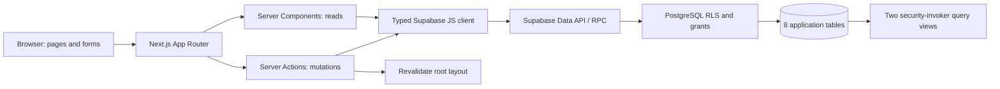
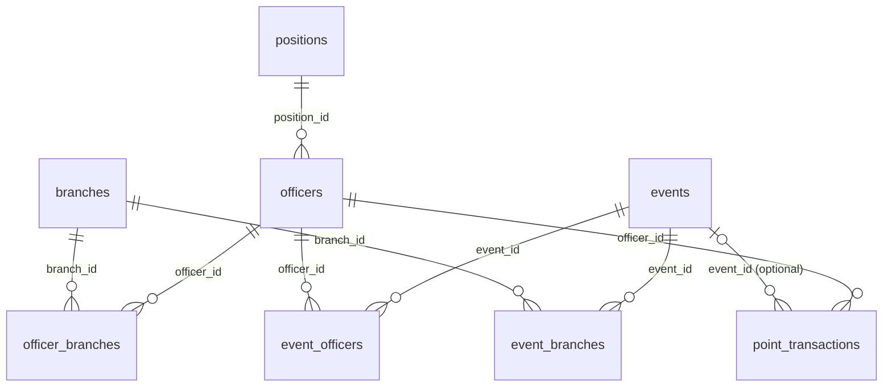

# Cappy Hub — POC Technical Report

> **Implementation snapshot:** 2026-09-27 UTC. This report describes the repository and connected Supabase project inspected at this date; it is not a specification for future work. The Design Doc remains the product-intent document.

## 1. Purpose and Scope

This report is the technical source of truth for the **current implementation** of the Cappy Hub proof of concept (POC). The current Design Doc supplied for this implementation describes the intended product. This report records what repository code and the connected Supabase database actually implement. When they differ, this report describes the implementation and identifies the difference; it does not change the Design Doc.

The POC demonstrates this connected flow:

```text
Officer → Event → Signup/association → Scheduled event end
        → Automatic participation points → Transaction history/totals → Dashboard
```

It is a working prototype, not a production-ready administrative system. It has no login, final role-based authorization, trusted scheduled worker, or audit trail. Its explicitly named anonymous RLS policies expose development data and write operations to anyone with the public project URL and publishable key. Use development data only until authentication and production permissions replace these policies.

## 2. Current Feature Status

| Area      | Implemented                                                                                                                                                                                                       | Prototype limitation                                                                                                         |
| --------- | ----------------------------------------------------------------------------------------------------------------------------------------------------------------------------------------------------------------- | ---------------------------------------------------------------------------------------------------------------------------- |
| Dashboard | Active-officer count, upcoming-event count, current UTC half-year points sum, next 10 upcoming events, latest 10 point transactions.                                                                              | Derived on request; no charts, live timer, filters, or pagination.                                                           |
| Officers  | List, create, profile, edit, activate/deactivate; one catalog position, five optional classifications and two optional email fields, multiple branches; associated events, total points, latest 100 transactions. | No authentication, warnings, account linking, or authorization.                                                              |
| Events    | List, create, detail, edit upcoming events, cancel before end, associate one or more branches, add/remove active-officer signups while open; related points history.                                              | Type is free text; no recurring events, early completion, attendance verification, or flyer/files workflow.                  |
| Points    | Numeric fractional positive and negative manual/correction entries with a reason and optional event; automatic duration-based participation awards; calculated totals.                                            | Page-load processing; latest 50 transactions on Points and 100 on profiles; no authorization to protect award entry or rate. |

The six event-type suggestions and five classification choices are application form values. Event types are not a database-controlled catalog. Position and branch values are database rows.

## 3. Technology Stack

Versions below come from the installed dependency tree and the linked Supabase project inspected on the report date.

| Technology            | Current version/configuration                                   | Responsibility                                                                                       |
| --------------------- | --------------------------------------------------------------- | ---------------------------------------------------------------------------------------------------- |
| Next.js               | 16.3.6, App Router                                              | Server-rendered pages, routing, server actions, build.                                               |
| React / React DOM     | 19.2.8                                                          | Rendering and client-side form state.                                                                |
| TypeScript            | 5.9.3 installed; `strict` project configuration                 | Type checking; generated Supabase types are in `lib/database.types.ts`.                              |
| Supabase JS           | 2.117.2                                                         | Typed calls to PostgREST/RPC using the public project URL and publishable key.                       |
| Supabase / PostgreSQL | Project `CappyHub`; PostgreSQL 17.6.1.166, `us-east-2`          | Hosted database, constraints, functions, views, and RLS. No Supabase Auth login flow is implemented. |
| Tailwind CSS          | 4.3.3                                                           | Existing utility CSS setup; a small set of simple controls is styled in `app/globals.css`.           |
| npm                   | Lockfile version 3; app CI runs Node 24                         | Dependency install and scripts.                                                                      |
| ESLint                | 9.39.5; Next ESLint config 16.3.6                               | `npm run lint`.                                                                                      |
| Prettier              | 3.9.9                                                           | `npm run format` and `npm run format:check`.                                                         |
| GitHub Actions        | `.github/workflows/ci.yml`; checkout v4, setup-node v4, Node 24 | Runs lint, formatting, TypeScript, and production-build checks.                                      |

The development session used Node 26.8.2; CI is pinned to Node 24. The repository does not declare Node as a package engine.

## 4. Project Structure

Important application files (generated and dependency directories omitted):

```text
.github/workflows/ci.yml
app/
  layout.tsx
  page.tsx
  error.tsx
  not-found.tsx
  officers/
    page.tsx
    actions.ts
    new/page.tsx
    new/officer-form.tsx
    [id]/page.tsx
    [id]/edit/page.tsx
  events/
    page.tsx
    actions.ts
    event-form.tsx
    event-controls.tsx
    new/page.tsx
    [id]/page.tsx
    [id]/edit/page.tsx
  points/
    page.tsx
    actions.ts
    transaction-form.tsx
    transaction-table.tsx
components/
  site-navigation.tsx
  ui.tsx
lib/
  presentation.ts
  supabase.ts
  database.types.ts
  event-status.ts
  participation.ts
supabase/migrations/
  20260927010717_officer_management.sql
  20260927011257_event_management.sql
  20260927011746_participation_points.sql
  20260927012410_dashboard_summary.sql
  20260927170954_officer_contact_classification.sql
README.md
package.json
package-lock.json
```

`app` contains the four routes and server actions. The adjacent `*-form.tsx` files contain small client forms. `lib/supabase.ts` constructs the typed, publishable-key client. `lib/event-status.ts` derives event status and formats UTC dates. `lib/participation.ts` reads the points-per-hour setting and invokes the completion RPC. The SQL migration files define the schema in replayable order. The README is the contributor setup and workflow guide.

## 5. Application Architecture

Next.js App Router pages are async **Server Components**. Pages call `await connection()` before database reads so requests and database-dependent pages are rendered dynamically rather than queried during static build. They query Supabase directly with the generated `Database` type. There is no ORM, separate repository/service layer, or application API route layer.

Forms are **Client Components** where pending/error state is useful. They submit to Next.js Server Actions (`"use server"`); actions call typed Supabase RPCs or inserts/updates, return an error state or redirect, and revalidate the root layout after successful changes. The SQL save RPCs run as the caller and keep a record update plus its junction-table changes in one database transaction. Signup and cancellation are separate actions.

The shared navigation is Dashboard, Events, Officers, Points, with a branded top bar and active-route indicator. Shared presentation components provide page/section headings, buttons, restrained badges, point colors, and scrollable table frames. The UI uses the existing Tailwind setup with a dark zinc palette, responsive Dashboard stat cards, and a Points form panel. Database errors enter the generic `app/error.tsx` boundary; missing numeric records use `app/not-found.tsx` and a 404 route.



All current pages and forms use the same public-client Supabase configuration. Server Actions execute on the server, but their Supabase requests still use the anonymous role; a Server Action is not an authenticated trust boundary here.

## 6. Routes and Pages

All route pages listed below are Server Components. Forms and row-action controls embedded in pages are Client Components.

| Route                 | Purpose and main data                                                                                                                           |
| --------------------- | ----------------------------------------------------------------------------------------------------------------------------------------------- |
| `/`                   | Dashboard view, upcoming `events` with signup counts, latest `point_transactions`, and `dashboard_summary` view. Calls participation processor. |
| `/officers`           | Officer directory joined with `positions` and `officer_branches`/`branches`. Calls processor.                                                   |
| `/officers/new`       | Loads branch and position options; renders the officer form.                                                                                    |
| `/officers/[id]`      | Officer and joins, total from `officer_point_totals`, `event_officers` history, latest 100 transactions. Calls processor.                       |
| `/officers/[id]/edit` | Loads one officer and branch memberships plus current positions/branches.                                                                       |
| `/events`             | Event list joined with branch names and signup counts. Calls processor.                                                                         |
| `/events/new`         | Loads branches and renders the event form.                                                                                                      |
| `/events/[id]`        | Event and branch/officer associations, latest 100 related point transactions, signup/cancel controls. Calls processor.                          |
| `/events/[id]/edit`   | Loads an event and its branch associations. Application save function only permits an upcoming, noncancelled event.                             |
| `/points`             | Calls processor; lists officer totals, a manual/correction form, and latest 50 transactions.                                                    |

`/not-found` is Next.js's not-found surface, not a separate application page folder. Invalid/nonexistent officer and event IDs use that shared not-found page.

## 7. Database Overview

The live project has exactly eight `public` base tables, all with RLS enabled and not FORCE-RLS. It also has two `security_invoker` views, four RPC functions, indexes, and no other application tables in the inspected public schema. Views do not count as base tables.



`officer_point_totals` and `dashboard_summary` are ordinary query views with `security_invoker=true`; they derive results from current records and store no totals.

## 8. Database Tables

The column/default/nullability facts below were checked against the live schema. All IDs use `bigint` identity columns generated `BY DEFAULT`; all displayed foreign keys use PostgreSQL's default `NO ACTION` deletion behavior (no cascading history deletion). Each primary-key/index name is reported with the live indexes. PostgreSQL unique constraints are backed by unique indexes.

### `officers`

Purpose: officer directory and reference point for positions, memberships, signups, and awards.

| Column           | PostgreSQL type            | Nullable | Default    | Notes                                                    |
| ---------------- | -------------------------- | -------: | ---------- | -------------------------------------------------------- |
| `id`             | `bigint`                   |       No | identity   | Primary key.                                             |
| `name`           | `text`                     |       No | —          | Nonblank check.                                          |
| `utep_email`     | `text`                     |      Yes | `NULL`     | Optional; valid format and case-insensitive uniqueness.  |
| `personal_email` | `text`                     |      Yes | `NULL`     | Optional; valid format and case-insensitive uniqueness.  |
| `position_id`    | `bigint`                   |       No | —          | References `positions.id`.                               |
| `classification` | `text`                     |      Yes | `NULL`     | Optional; freshman, sophomore, junior, senior, graduate. |
| `status`         | `text`                     |       No | `'active'` | Check-listed status.                                     |
| `created_at`     | `timestamp with time zone` |       No | `now()`    | Creation time.                                           |

**Primary key:** `officers_pkey (id)`. **Unique expression indexes:** `officers_utep_email_key (lower(utep_email))` and `officers_personal_email_key (lower(personal_email))`; multiple nulls are allowed in each field, and uniqueness is separate for each contact field. **Foreign key:** `officers_position_id_fkey (position_id) → positions(id)`. **Checks:** `officers_name_not_blank`; `officers_utep_email_format`; `officers_personal_email_format`; `officers_classification_check`; `officers_status_check`. **Secondary index:** `officers_position_id_idx (position_id)`.

### `positions`

Purpose: one controlled club title per officer; its boolean permission marker is present but not used to authorize actions.

| Column                     | PostgreSQL type            | Nullable | Default  | Notes                                          |
| -------------------------- | -------------------------- | -------: | -------- | ---------------------------------------------- |
| `id`                       | `bigint`                   |       No | identity | Primary key.                                   |
| `name`                     | `text`                     |       No | —        | Unique, nonblank.                              |
| `can_manage_branch_events` | `boolean`                  |       No | `false`  | Not used by current application authorization. |
| `created_at`               | `timestamp with time zone` |       No | `now()`  | Creation time.                                 |

**Primary key:** `positions_pkey (id)`. **Unique:** `positions_name_key (name)`. **Check:** `positions_name_check`. No secondary index.

### `branches`

Purpose: controlled branch names shared by officers and events.

| Column       | PostgreSQL type            | Nullable | Default  | Notes          |
| ------------ | -------------------------- | -------: | -------- | -------------- |
| `id`         | `bigint`                   |       No | identity | Primary key.   |
| `name`       | `text`                     |       No | —        | Unique.        |
| `created_at` | `timestamp with time zone` |       No | `now()`  | Creation time. |

**Primary key:** `branches_pkey (id)`. **Unique:** `branches_name_key (name)`. No secondary index.

### `officer_branches`

Purpose: many-to-many officer/branch memberships.

| Column       | PostgreSQL type | Nullable | Default | Notes                     |
| ------------ | --------------- | -------: | ------- | ------------------------- |
| `officer_id` | `bigint`        |       No | —       | References `officers.id`. |
| `branch_id`  | `bigint`        |       No | —       | References `branches.id`. |

**Primary key and pair uniqueness:** `officer_branches_pkey (officer_id, branch_id)`. **Foreign keys:** `officer_branches_officer_id_fkey`; `officer_branches_branch_id_fkey`. **Secondary index:** `officer_branches_branch_id_idx (branch_id)`.

### `events`

Purpose: scheduled events, with an explicit stored cancellation status and status values also checked by the application clock.

| Column        | PostgreSQL type            | Nullable | Default      | Notes                                                                                                 |
| ------------- | -------------------------- | -------: | ------------ | ----------------------------------------------------------------------------------------------------- |
| `id`          | `bigint`                   |       No | identity     | Primary key.                                                                                          |
| `name`        | `text`                     |       No | —            | Nonblank check.                                                                                       |
| `description` | `text`                     |       No | `''`         | Empty description allowed.                                                                            |
| `type`        | `text`                     |       No | —            | Nonblank; not a closed catalog.                                                                       |
| `location`    | `text`                     |      Yes | `NULL`       | Optional.                                                                                             |
| `starts_at`   | `timestamp with time zone` |       No | —            | Schedule start.                                                                                       |
| `ends_at`     | `timestamp with time zone` |       No | —            | Schedule end, after start.                                                                            |
| `status`      | `text`                     |       No | `'upcoming'` | Check allows upcoming, happening, past, cancelled. App writes cancellation; normal status is derived. |
| `created_at`  | `timestamp with time zone` |       No | `now()`      | Creation time.                                                                                        |

**Primary key:** `events_pkey (id)`. **Checks:** `events_name_check`, `events_type_check`, `events_status_check`, `events_check (ends_at > starts_at)`. **Secondary index:** `events_starts_at_idx (starts_at)`.

### `event_branches`

Purpose: many-to-many event/branch associations.

| Column      | PostgreSQL type | Nullable | Default | Notes                     |
| ----------- | --------------- | -------: | ------- | ------------------------- |
| `event_id`  | `bigint`        |       No | —       | References `events.id`.   |
| `branch_id` | `bigint`        |       No | —       | References `branches.id`. |

**Primary key and pair uniqueness:** `event_branches_pkey (event_id, branch_id)`. **Foreign keys:** `event_branches_event_id_fkey`; `event_branches_branch_id_fkey`. **Secondary index:** `event_branches_branch_id_idx (branch_id)`.

### `event_officers`

Purpose: many-to-many relationship recording an officer's event signup/association. There is no separate signup timestamp or actor.

| Column       | PostgreSQL type | Nullable | Default | Notes                     |
| ------------ | --------------- | -------: | ------- | ------------------------- |
| `event_id`   | `bigint`        |       No | —       | References `events.id`.   |
| `officer_id` | `bigint`        |       No | —       | References `officers.id`. |

**Primary key and pair uniqueness:** `event_officers_pkey (event_id, officer_id)`. **Foreign keys:** `event_officers_event_id_fkey`; `event_officers_officer_id_fkey`. **Secondary index:** `event_officers_officer_id_idx (officer_id)`.

### `point_transactions`

Purpose: append-only-through-the-anonymous-API numeric point history. “Append-only” here means anon has no update/delete grants or policies; a database owner can still alter rows.

| Column       | PostgreSQL type            | Nullable | Default  | Notes                                                                |
| ------------ | -------------------------- | -------: | -------- | -------------------------------------------------------------------- |
| `id`         | `bigint`                   |       No | identity | Primary key.                                                         |
| `officer_id` | `bigint`                   |       No | —        | References `officers.id`.                                            |
| `event_id`   | `bigint`                   |      Yes | `NULL`   | Optional `events.id`.                                                |
| `points`     | `numeric`                  |       No | —        | No fixed scale; finite numeric checked; fractional values supported. |
| `reason`     | `text`                     |       No | —        | Nonblank check.                                                      |
| `award_type` | `text`                     |       No | —        | Participation, manual, or correction.                                |
| `created_by` | `uuid`                     |      Yes | `NULL`   | No auth actor/FK is implemented.                                     |
| `created_at` | `timestamp with time zone` |       No | `now()`  | Transaction time.                                                    |

**Primary key:** `point_transactions_pkey (id)`. **Foreign keys:** `point_transactions_officer_id_fkey`; `point_transactions_event_id_fkey`. **Checks:** finite `points`; nonblank `reason`; allowed `award_type`; participation must have a nonnull `event_id`. **Indexes:** `one_participation_award (officer_id, event_id) WHERE award_type = 'participation'` (unique); `point_transactions_event_id_idx`; `point_transactions_created_at_idx`; `point_transactions_officer_id_idx`.

The `officer_id` and `event_id` history references remain valid; no cascade is specified. There is no DB-level `points <> 0` check; the manual server action rejects zero, but arbitrary allowed anonymous API inserts do not go through that validation.

## 9. Database Relationships

Each officer references exactly one required position through `officers.position_id`. Position name is data, so a title can be added without a schema check change. `officer_branches` resolves the many-to-many officer/branch relationship; `event_branches` resolves event/branch; `event_officers` resolves officer/event. Composite primary keys make each pair unique while permitting either side to be linked to many rows.

A point row always references one officer, optionally one event. Keeping each award/correction as a row means totals can be re-derived and original entries can remain visible. SQL `NO ACTION` foreign-key behavior prevents deleting referenced historical rows rather than deleting related history automatically.

## 10. Controlled / Seed Data

The **live database** contains four branch rows: `general`, `icpc`, `intro`, `social`.

It contains 16 positions: the 15 initial catalog titles plus `ICPC/CIC Academic Officer`. The previous legacy `Academic Officer` title was removed during the earlier roster replacement; `ICPC/Academic Officer` remains a catalog option. The latest roster changed the ICPC Lead assignment and added the ICPC/CIC title while preserving officer identities. All live `can_manage_branch_events` values are currently `false`; this field does not authorize anything. Roster import is a separate data update, not a seed containing personal contact details in source control.

Classification is nullable text constrained, when present, to `freshman`, `sophomore`, `junior`, `senior`, `graduate`. The migration converts existing `masters` and `phd` values to `graduate`. Blank roster classifications are stored as null, replacing earlier provisional classifications. Officer status is stored as text constrained to `active`, `inactive`. Event status allows `upcoming`, `happening`, `past`, `cancelled`, but the app derives the first three on read and explicitly writes `cancelled`. Point award type is stored as text constrained to `participation`, `manual`, `correction`.

The six event-type suggestions (`General`, `Intro`, `ICPC`, `Meeting`, `Social`, `Workshop`) and five classification options are coded in the forms. Only classifications are mirrored in a database check; any nonblank event type can be saved. Signup branches are selected from `branches`; position options come from `positions`.

## 11. Row Level Security

The connected database was inspected directly on 2026-09-27. RLS is enabled on all eight tables (not `FORCE ROW LEVEL SECURITY`). There are 21 current policies. Every policy is an explicitly named **TEMPORARY DEVELOPMENT POLICY** for role `anon`. The `authenticated` role has no table/view grants or policies in this snapshot.

| Table                | Policy                                        | Action / role | `USING`                                                                 | `WITH CHECK`                                                            | Practical effect                                             |
| -------------------- | --------------------------------------------- | ------------- | ----------------------------------------------------------------------- | ----------------------------------------------------------------------- | ------------------------------------------------------------ |
| `positions`          | `TEMPORARY DEVELOPMENT read positions`        | SELECT / anon | `true`                                                                  | —                                                                       | Anonymous position catalog read.                             |
| `branches`           | `TEMPORARY DEVELOPMENT read branches`         | SELECT / anon | `true`                                                                  | —                                                                       | Anonymous branch catalog read.                               |
| `officers`           | `TEMPORARY DEVELOPMENT read officers`         | SELECT / anon | `true`                                                                  | —                                                                       | Read all officers.                                           |
| `officers`           | `TEMPORARY DEVELOPMENT insert officers`       | INSERT / anon | —                                                                       | `true`                                                                  | Insert officer rows.                                         |
| `officers`           | `TEMPORARY DEVELOPMENT update officers`       | UPDATE / anon | `true`                                                                  | `true`                                                                  | Update officer rows.                                         |
| `officer_branches`   | `TEMPORARY DEVELOPMENT read memberships`      | SELECT / anon | `true`                                                                  | —                                                                       | Read memberships.                                            |
| `officer_branches`   | `TEMPORARY DEVELOPMENT insert memberships`    | INSERT / anon | —                                                                       | `true`                                                                  | Add memberships.                                             |
| `officer_branches`   | `TEMPORARY DEVELOPMENT remove memberships`    | DELETE / anon | `true`                                                                  | —                                                                       | Remove memberships.                                          |
| `events`             | `TEMPORARY DEVELOPMENT read events`           | SELECT / anon | `true`                                                                  | —                                                                       | Read events.                                                 |
| `events`             | `TEMPORARY DEVELOPMENT create events`         | INSERT / anon | —                                                                       | `true`                                                                  | Insert event rows.                                           |
| `events`             | `TEMPORARY DEVELOPMENT update future events`  | UPDATE / anon | `ends_at > now()`                                                       | `true`                                                                  | Update rows whose current scheduled end is in the future.    |
| `event_branches`     | `TEMPORARY DEVELOPMENT read event branches`   | SELECT / anon | `true`                                                                  | —                                                                       | Read event/branch associations.                              |
| `event_branches`     | `TEMPORARY DEVELOPMENT insert event branches` | INSERT / anon | —                                                                       | `true`                                                                  | Add associations.                                            |
| `event_branches`     | `TEMPORARY DEVELOPMENT remove event branches` | DELETE / anon | `true`                                                                  | —                                                                       | Remove associations.                                         |
| `event_officers`     | `TEMPORARY DEVELOPMENT read signups`          | SELECT / anon | `true`                                                                  | —                                                                       | Read signups.                                                |
| `event_officers`     | `TEMPORARY DEVELOPMENT add signups`           | INSERT / anon | —                                                                       | `EXISTS` matching event with `ends_at > now()` and status not cancelled | Add signups before the event ends if it is not cancelled.    |
| `event_officers`     | `TEMPORARY DEVELOPMENT remove signups`        | DELETE / anon | `EXISTS` matching event with `ends_at > now()` and status not cancelled | —                                                                       | Remove signups before the event ends if it is not cancelled. |
| `point_transactions` | `TEMPORARY DEVELOPMENT read points`           | SELECT / anon | `true`                                                                  | —                                                                       | Read point history.                                          |
| `point_transactions` | `TEMPORARY DEVELOPMENT insert points`         | INSERT / anon | —                                                                       | `created_by IS NULL`                                                    | Insert a point transaction without an actor ID.              |

Database privileges further limit the PostgREST-facing `anon` role: positions and branches SELECT; officers SELECT/INSERT/UPDATE; officer branches SELECT/INSERT/DELETE; events SELECT/INSERT/UPDATE; event branches and event officers SELECT/INSERT/DELETE; point transactions SELECT/INSERT; both views SELECT. Identity sequence usage is granted where needed. `authenticated` has no such grants in the inspected schema. Function EXECUTE is explicitly granted to anon for the four current RPCs after revoke from `PUBLIC`.

These policies do **not** authenticate a person. Anyone with the project URL and publishable key can read all POC data and make the permitted anonymous writes. In particular, the policies are not the future admin/officer/branch-lead authorization model. They must be replaced before production. Supabase security advisor returned no security findings on the inspection date; this does not make the current authorization production-ready.

## 12. Supabase Integration

`lib/supabase.ts` reads `NEXT_PUBLIC_SUPABASE_URL` and `NEXT_PUBLIC_SUPABASE_PUBLISHABLE_KEY`, verifies both exist, then constructs `createClient<Database>()`. App pages and server actions import this single typed client. Generated `lib/database.types.ts` describes all eight tables, two views, relationships, and RPC signatures; `Tables<...>` is used for form types.

`NEXT_PUBLIC_` values are public client-safe project configuration. The repository's application source contains no service-role client or service-role credential use; all Supabase requests shown in code use the publishable key and therefore the anonymous role without a session. CI provides fake public values to build without contacting the live project. `.env.local` is ignored and was not read or included in this report. No credential values appear here.

The database RPCs are `SECURITY INVOKER` functions with an empty `search_path`; their explicit grants allow `anon`. `process_completed_events(p_points_per_hour)` accepts its rate as an RPC parameter. Since anon can call this RPC directly, the rate configured for the Next.js page is not a security boundary and a caller can request processing at another rate. The production design needs trusted server identity/access controls before treating this as protected business logic.

The current `save_officer` signature requires `p_name`, `p_position_id`, `p_status`, and `p_branch_ids`; `p_officer_id`, `p_utep_email`, `p_personal_email`, and `p_classification` default to null. The Server Action omits empty optional values so the database defaults apply. An edit can clear either email or classification. The former `p_email` signature and table column are absent.

## 13. Officer Workflow

1. `/officers` queries `officers`, joins `positions(name)` and `officer_branches(branches(name))`, and orders by name.
2. `/officers/new` loads branch and position IDs/names from the database. The shared `OfficerForm` accepts name, optional UTEP email, optional personal email, one required position, optional classification, status, and zero or more branch checkboxes.
3. `saveOfficer` Server Action passes those fields to `save_officer`. The invoker function trims/lowercases both emails, converts blank emails and classification to null, inserts or updates an officer, replaces its `officer_branches` rows, and returns the ID in one database transaction. PostgreSQL validates provided email formats, independent case-insensitive email uniqueness, actual foreign keys, nonblank name, status, and optional classification. An application update that fails rolls back its memberships as part of the same RPC transaction.
4. `/officers/[id]` displays officer details and branch memberships, gets the calculated total from `officer_point_totals`, gets associated events through `event_officers`, and displays up to 100 point transactions. It calls `processCompletedEvents()` before reading.
5. `/officers/[id]/edit` loads existing `officer_branches(branch_id)` and seeds the same form. Choosing inactive/active saves status through the same RPC; records are not deleted when deactivated.

The position select is live controlled data; classifications are a hardcoded select backed by a database CHECK. An officer may have no branches (the form does not require a checkbox); the database only enforces valid unique pairs. Profiles display all associated current event-signup relationships, but a removed signup is physically deleted rather than recorded in a signup-history table.

## 14. Event Workflow

`/events/new` loads branch choices. The form collects name, description, free-text type with six suggestions, optional location, UTC `datetime-local` start/end, and branch checkboxes. `saveEvent` submits ISO UTC values to `save_event`; that RPC requires at least one branch, inserts/updates the event and replaces its `event_branches` rows atomically. PostgreSQL independently enforces `ends_at > starts_at`, required date values, nonblank name/type, and branch foreign keys.

The RPC permits edits only when the current event is upcoming (`starts_at > now()`) and is not cancelled. Cancellation writes `status = 'cancelled'` before event end. The event and its links are retained. The UI displays event start/end in UTC and associated branch names.

`eventStatus()` first returns cancelled for an explicitly cancelled row. Otherwise it compares the current clock with schedule: before start = upcoming; from start until end = happening; at/after end = past. Those three statuses are derived in application code; no scheduler updates the stored status. The status CHECK constrains possible stored strings.

The detail page lists current `event_officers`, their names, and up to 100 related point transactions. Its add control lists only active officers not already signed up; remove controls operate on an existing association. `change_event_signup` locks the event, rejects cancelled/ended events, inserts with `ON CONFLICT DO NOTHING`, or deletes the selected pair. The composite primary key guarantees the same officer/event pair cannot occur twice. An ended event's signup rows remain for automatic award processing. Direct API/RPC authorization is still anonymous development access; the UI selection is not a permission check.

## 15. Automatic Participation Points

The shared helper `lib/participation.ts` reads `PARTICIPATION_POINTS_PER_HOUR` using `Number(process.env... ?? 1)` and rejects a nonfinite or nonpositive rate. The current source fallback is **1 point per hour**. The value is not stored in the database. A deployment/local environment may set the variable without the `NEXT_PUBLIC_` prefix; restart the app after a change. Rate changes affect unprocessed events only, not existing transactions.

**Trigger:** dashboard, event list/detail, officer list/detail, and Points server page rendering invoke `processCompletedEvents()`. No event-specific rate snapshot or application configuration table exists. No cron/scheduler runs while the app is idle; loading/prefetching a relevant page may process completed events. Request-time rendering calls the RPC with the configured rate.

The SQL function `process_completed_events(numeric)` selects `event_officers` joined to events where `ends_at <= now()` and `status <> 'cancelled'`. Each award is:

```text
(extract epoch from ends_at - starts_at) / 3600 × points_per_hour
```

It inserts `point_transactions` with the signup's `officer_id`, event ID, the computed numeric value, reason `Scheduled event participation`, default `created_at`, null `created_by`, and `award_type = 'participation'`. The Database supports fractional numeric values without a fixed scale. UI rendering shows at most six fractional digits.

```mermaid
flowchart TD
  Load[Relevant server page loads] --> RPC[process_completed_events(rate)]
  RPC --> Ended[Find noncancelled events whose ends_at has passed]
  Ended --> Signups[Join event_officers]
  Signups --> Duration[Scheduled duration in seconds / 3600]
  Duration --> Award[Multiply by rate; insert participation transaction]
  Award --> Unique[Unique partial index: officer_id, event_id]
  Unique --> Once[ON CONFLICT DO NOTHING: one award per pair]
```

Live PostgreSQL idempotency is the unique partial index `one_participation_award` on `(officer_id, event_id) WHERE award_type = 'participation'`. The processor uses `ON CONFLICT ... DO NOTHING`, so repeated or concurrent processing does not create a second participation award. Cancelled events are excluded. No award is produced for an event without an `event_officers` row.

Limitations: page-load rather than scheduled processing; no processing while idle; no authentication; the anon RPC accepts a caller-supplied rate; no attendance check or UI for removing an erroneous generated award; a rate changed before an old unprocessed event is first loaded applies the new rate to it. The prototype adds no point audit/system-log entry.

## 16. Manual Points

On `/points`, the client form selects an officer, accepts a number input with `step="any"`, required reason, award type (`manual` or `correction`), and optional event. Server Action `addTransaction` rejects missing, zero, or nonfinite numbers, blank reasons, and disallowed award type. It inserts a `point_transactions` row with `created_by = null`. PostgreSQL foreign keys and checks validate the officer/event, finite numeric value, nonblank reason, and permitted award type. Positive, negative, and fractional values are accepted. A correction is an additional `correction` transaction (or a `manual` entry with a reason); prior transactions are not edited.

There is no stored `total_points` column. `officer_point_totals` groups officers and `SUM(point_transactions.points)`; the officer profile and Points page use this derived view. The optional event FK is null for an event-independent correction.

## 17. Dashboard Calculations

The `dashboard_summary` view computes values from live tables on every query; it does not store a cached count or total. Both views set `security_invoker=true` and have anon SELECT grants.

- **Active officers:** count `officers.status = 'active'`.
- **Upcoming event count:** count events whose stored status is not cancelled and `starts_at > now()`. Given the enforced `ends_at > starts_at`, these have not started yet. A happening event is not in this count.
- **Current half-year points:** sum signed transaction points whose **transaction** `created_at` is at or after the current period start in UTC and before six months later. Periods are January 1 through July 1 and July 1 through January 1 UTC. Negative corrections subtract from the display.
- **Upcoming list:** independently queries noncancelled events with `starts_at > now()`, ordered soonest first, limited to 10; each shows current signup count. It is not every event counted by a saved snapshot.
- **Recent activity:** latest 10 transaction rows ordered by `created_at`, then ID descending.

## 18. Data Integrity

**Enforced by PostgreSQL:** identity primary keys; all listed FKs; separate case-insensitive uniqueness for provided UTEP/personal emails, unique position name and branch name; unique composite officer/branch, event/branch, event/officer pairs; valid position/status/classification references/values; nonblank officer name, valid provided email syntax, nonblank position name, event name/type, point reason; event end after start; finite numeric points; valid award type; participation requires an event; no duplicate participation award per officer/event; RLS and explicit anon table privileges; unique history reference protections. Secondary lookup indexes are enumerated in Section 8.

**Enforced by application/SQL functions rather than a column CHECK:** lowercase/trim and blank-to-null normalization happen in `save_officer`; requiring at least one event branch is in `save_event`; only upcoming events may be edited via that RPC; signups close at end/cancellation via RPC and RLS; the manual UI action rejects zero and a blank reason. Direct anonymous table grants mean not all user-facing checks can be assumed for arbitrary API inserts; notably branchless event rows and zero-value manual/correction transactions are not ruled out by a database CHECK. Database constraints remain the final authority for referential, pair-uniqueness, date-order, and enumerated text data.

## 19. Environment Variables

Names only; no values are included.

| Variable                               | Purpose                                                                                              | Browser safety                                                                                                                                                       |
| -------------------------------------- | ---------------------------------------------------------------------------------------------------- | -------------------------------------------------------------------------------------------------------------------------------------------------------------------- |
| `NEXT_PUBLIC_SUPABASE_URL`             | Supabase project API URL.                                                                            | Public/client-safe.                                                                                                                                                  |
| `NEXT_PUBLIC_SUPABASE_PUBLISHABLE_KEY` | Client-safe key used to initialize the shared Supabase JS client; requests use `anon` without login. | Public by design; authorization must come from RLS.                                                                                                                  |
| `PARTICIPATION_POINTS_PER_HOUR`        | Server-side points-per-scheduled-hour setting; defaults to 1 in `lib/participation.ts`.              | Not `NEXT_PUBLIC_`; used by server-rendered code and sent as the RPC argument. The RPC is itself executable by anon, so this is not a secure authorization boundary. |

No service-role/secret key variable or service-role client is used in repository application code. `.env.local` is ignored. Never put a service credential into a `NEXT_PUBLIC_` variable or commit `.env.local`.

## 20. CI / Code Quality

`.github/workflows/ci.yml` runs on pull requests targeting `main` and pushes to `main`, on Ubuntu. It checks out with `actions/checkout@v4`, installs Node **24** with `actions/setup-node@v4` and npm caching, then runs `npm ci`, lint, formatting check, typecheck, and production build. Build-only public Supabase placeholder values are configured in workflow YAML; no real project credentials are required at build time. The pages that query Supabase are dynamic/request-time pages.

Local equivalents:

```sh
npm ci
npm run lint
npm run format:check
npm run typecheck   # next typegen && tsc --noEmit
npm run build
```

No automated test script or test framework currently exists. CI checks code style/types/build, not an automated workflow suite.

## 21. Git / GitHub Workflow

The README's **Git & GitHub Workflow** section is the contributor-facing quick reference. It documents syncing stable `main`, `git fetch --prune`, short-lived lowercase kebab-case prefixed branches, conventional commits and PR titles, Summary/Changes/Testing/optional Notes, required local/CI checks, Squash and Merge, remote branch deletion, and post-merge main synchronization. It prohibits force-pushing or rewriting shared `main` and committing secrets. Read the [README](README.md) for copyable commands; this report does not duplicate the full process.

## 22. Migrations

The five live migration-history versions match the five checked-in migration filenames; no version/name mismatch was observed. They were applied to the inspected connected development project in this order:

| Migration                                           | Change                                                                                                                                                                                                                                                                                        |
| --------------------------------------------------- | --------------------------------------------------------------------------------------------------------------------------------------------------------------------------------------------------------------------------------------------------------------------------------------------- |
| `20260927010717_officer_management.sql`             | Captures the original officers/branches/memberships schema for replay, seeds four branches, creates/seed controlled positions, preserves legacy titles, migrates `officers.position` to required `position_id`, adds indexes, temporary RLS/grants, and atomic `save_officer` RPC.            |
| `20260927011257_event_management.sql`               | Adds `events`, `event_branches`, `event_officers`, date/name/status constraints and indexes, temporary RLS/grants, atomic `save_event`, and signup RPC.                                                                                                                                       |
| `20260927011746_participation_points.sql`           | Adds `point_transactions`, constraints/indexes including idempotent participation partial unique index, temporary RLS/grants, `officer_point_totals` view, and completed-event processing RPC.                                                                                                |
| `20260927012410_dashboard_summary.sql`              | Adds derived `dashboard_summary` view, explicit read-only grants for both security-invoker views, and transaction officer lookup index.                                                                                                                                                       |
| `20260927170954_officer_contact_classification.sql` | Converts masters/phd to graduate, makes classification nullable, splits and preserves legacy email values into two nullable contact fields, adds syntax checks and independent case-insensitive unique indexes, and replaces the officer RPC with optional contact/classification parameters. |

The new contact/classification migration was applied and its schema inspected directly. Historical migration files remain unchanged; replaying all five produces the current schema. The migration routes existing UTEP-domain addresses to `utep_email`, retains other legacy addresses in `personal_email`, preserves IDs and references, and replaces the old RPC signature. The supplied roster was then applied as a separate data-only update; real contacts are omitted from migration files and this report.

## 23. Current Security Model

### Currently implemented

- One shared Supabase JS client uses a URL and public publishable key; no service credential appears in application source.
- All eight application tables have RLS enabled. Explicit anon privileges/policies support prototype workflows. The two views are security-invoker; four RPCs run as caller, use an empty search path, and explicitly grant EXECUTE to anon.
- PostgreSQL constraints protect foreign keys, uniqueness, date order, enumerated status/classification/award values, finite numeric values, and duplicate participation awards.
- `.env.local` is ignored. CI uses placeholders, not live secret credentials.

### Not production-ready / deferred

- No authentication, session, user identity, account-to-officer mapping, application roles, or final authorization.
- The anonymous role can read all officers, events, signups, and point transactions and can make policy/grant-permitted writes. Officer changes, events, signups, manual point inserts, and processing are not restricted to authenticated administrators or branch leads.
- The `can_manage_branch_events` marker currently is false for all positions and does not grant permissions.
- The participation processing RPC is callable by anon with a rate argument; the environment value in the app does not protect the database operation.
- `created_by` is nullable with no auth FK; no audit logging records writes or corrections.
- Database-owner/service roles can bypass ordinary anon RLS; no production service client is needed or created by current code.

Security advisor returned no findings in its query on 2026-09-27. That automated result does not substitute for the documented production authorization model.

## 24. Known Prototype Limitations

- No login/authentication, account linking, admin/branch-lead permissions, or final RLS.
- Temporary anonymous development policies; publishable key and RLS allow broad unauthenticated access by design of this prototype.
- Participation awards are processed on relevant page loads; no processing while idle and no production scheduler.
- UTC is assumed for event form input, storage/display. No per-user timezone handling or live transition timer.
- Events can be edited only through the app before start; no early completion, recurring events, flyer workflow, file/calendar/chat integrations, or attendance confirmation.
- Manual award/correction history is retained, but award removal and an audit/system log are not implemented.
- No warnings, warning approvals, search/filters, pagination, or automated tests. The UI reads at most 50 recent transactions on Points, 100 on detail pages, and 10 on Dashboard; those displayed totals still sum all records.
- Event signup removal deletes the current pair, so there is no retained signup-change history.

## 25. Design Doc Features Not Yet Implemented

This POC intentionally implements the Officers → Events → Signups → Participation points → totals → Dashboard vertical flow, not the entire intended MVP.

| Design Doc area        | POC status                                                                                                                                                             |
| ---------------------- | ---------------------------------------------------------------------------------------------------------------------------------------------------------------------- |
| Officers and positions | Core records/forms/profile implemented. Warnings, approvals, application roles, and permission use of position marker deferred.                                        |
| Events and branches    | Core create/list/detail/edit/cancel and branch links implemented. Recurrence, early completion, calendar invites, files, and flyer work deferred.                      |
| Event participation    | Add/remove signup for active officers before end is implemented. Identity-aware self-signup vs admin/lead assignment is not distinguished.                             |
| Points                 | Automatic participation and manual/correction transaction flows implemented. Admin-only controls, award removal, distinct flyer award, and actor attribution deferred. |
| Dashboard              | Specified summary values and short lists implemented from current rows. Charts and analytics are absent.                                                               |
| Authentication and RLS | Final auth, account linking, admin/officer/branch-scope policies deferred; temporary dev policies are in use.                                                          |
| System Log             | No audit log table or System Log UI/retention.                                                                                                                         |
| Other integrations     | Warnings, historical import, Drive/Discord/Google Calendar integration, recurring schedules deferred.                                                                  |

These are planned MVP areas from the Design Doc, not defects in the narrower POC. The current database has eight application tables and no warning, approval, or audit-log tables despite the Design Doc's broader MVP model.

## 26. Current End-to-End Workflow

1. **Create officer:** `/officers/new` loads `positions` and `branches`. `OfficerForm` sends fields to `saveOfficer`; the `save_officer` RPC inserts into `officers`, then inserts the selected `officer_branches` pairs. `position_id` points to a controlled position.
2. **Create event:** `/events/new` loads branch rows. `EventForm` sends schedule/details/selected branch IDs to `saveEvent`; `save_event` inserts `events` and its `event_branches` rows in one transaction.
3. **Sign up:** Event detail loads active officers and current `event_officers`; `changeSignup` calls `change_event_signup`, which inserts the composite event/officer pair once. Removal deletes that pair while signup is open.
4. **Event ends:** No status-maintenance job runs. `eventStatus()` displays past when end time passes. On the next Dashboard, Events, Officers, profile/detail, or Points server load, `processCompletedEvents()` calls the RPC.
5. **Award points:** `process_completed_events` joins ended noncancelled `events` to `event_officers`, computes schedule hours times the rate, and inserts a `participation` row in `point_transactions`. The partial unique index plus `ON CONFLICT DO NOTHING` means later page loads leave the same award unchanged.
6. **Show totals and histories:** `officer_point_totals` sums all transactions for each officer. Profile pages show associated events and up to 100 transactions; event pages show participants and up to 100 related point transactions; Points shows totals and latest 50. Manual/correction inserts are separate transaction rows.
7. **Update Dashboard:** the `dashboard_summary` view derives active officers, not-yet-started noncancelled events, and signed current UTC half-year points from the same underlying tables; the page also reads the next 10 events and latest 10 points. No summary table or cached total is written.

## 27. POC Snapshot

| Item                                                         | Value at report generation                                                                                                           |
| ------------------------------------------------------------ | ------------------------------------------------------------------------------------------------------------------------------------ |
| Report generation date                                       | 2026-09-27 UTC                                                                                                                       |
| Git branch                                                   | `feat/officer-contact-fields`                                                                                                        |
| Base commit before the contact/classification implementation | `01faf9abe41ff7d10215dde199978c6575484afe`                                                                                           |
| Supabase project inspected                                   | `CappyHub`, healthy, PostgreSQL 17, `us-east-2`                                                                                      |
| Application tables                                           | 8                                                                                                                                    |
| Applied/check-in migrations                                  | 5; versions match                                                                                                                    |
| Implemented product areas                                    | Dashboard, Officers, Events, Points                                                                                                  |
| Major remaining MVP systems                                  | Authentication/final authorization, trusted scheduled processing, audit/System Log, warnings, recurring events, flyers, integrations |

This snapshot covers the contact/classification implementation on the recorded branch, based on the commit above, and the inspected live schema on 2026-09-27. Later changes require re-verifying this document.

Live roster verification: 26 officers with 26 UTEP and 26 personal email values; 4 graduate, 7 senior, 4 sophomore, 3 junior, and 8 unspecified classifications. All 26 original officer IDs were preserved. The database still has 29 officer/branch memberships, 2 event signups, 1 point transaction, 3 events, and 4 branches. The import updates roster names and roles in place; existing memberships, signups, transactions, statuses, and creation timestamps are retained. No personal contact addresses are included in this report.

Verification: lint, formatting, TypeScript, and production build passed after the application changes. Rollback-only SQL checks ran as `anon` and exercised officer create/edit, graduate classification, clearing optional fields, normalization, both case-insensitive email unique indexes, malformed email rejection, rejection of masters/phd, and membership retention. Test records were rolled back. The security advisor returned no findings; the anonymous development access described above still applies to both contact fields.
